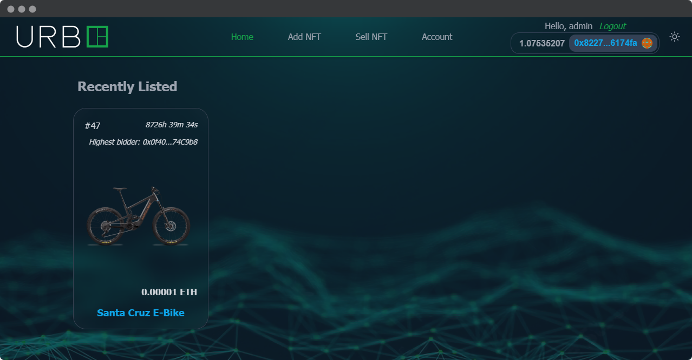

<h1 align="center">
    UrbE Auction
</h1>

<br/>

<p align="center">

</a>
</p>

<br/>

This project is a web application for a charity auction organized by UrbE, a micromobility company. 
The repository in question is the part of the project that uses Hardhat to create and manage the smart contracts for the auction.

The project uses Solidity, a programming language designed specifically for smart contracts on Ethereum, to write the auction and the NFT contract.

<hr/>
 
## 🗎&nbsp; Requirements
- [git](https://git-scm.com/book/en/v2/Getting-Started-Installing-Git)
    You'll know you did it right if you can run `git --version` and you see a response like `git version x.x.x`
    
- [Nodejs](https://nodejs.org/en/)

    You'll know you've installed nodejs right if you can run: `node --version` and get an ouput like: `vx.x.x`
- [Yarn](https://yarnpkg.com/getting-started/install) instead of `npm`
   
   You'll know you've installed yarn right if you can run: `yarn --version` and get an output like: `x.x.x`
   
   You might need to [install it with `npm`](https://classic.yarnpkg.com/lang/en/docs/install/) or `corepack`

## 🛠️&nbsp; How to run
- Clone the repo:
    ```
    git clone https://github.com/Meno96/urbe-auction-hardhat.git
    ```
- Enter the directory:
    ```
    cd urbe-auction-hardhat
    ```
- Install packages:
    ```
    yarn
    ```
    
## 🚀&nbsp; How it's suppose to work?

### Deploy

```
yarn hardhat deploy
```

### Testing

```
yarn hardhat test
```

#### Test Coverage

```
yarn hardhat coverage
```
 
### Deployment to a testnet or mainnet

1. Setup environment variables

    You'll want to set your `GOERLI_RPC_URL` and `PRIVATE_KEY` as environment variables. You can add them to a `.env` file, similar to what you see in `.env.example`.

    - `PRIVATE_KEY`: The private key of your account (like from [metamask](https://metamask.io/)). **NOTE:** FOR DEVELOPMENT, PLEASE USE A KEY THAT DOESN'T HAVE ANY REAL FUNDS ASSOCIATED WITH IT.
    - `GOERLI_RPC_URL`: This is url of the goerli testnet node you're working with. You can get setup with one for free from [Alchemy](https://alchemy.com/?a=673c802981)

2. Get testnet ETH

    Head over to [goerlifaucet.com](https://goerlifaucet.com/) and get some tesnet ETH. You should see the ETH show up in your metamask.

3. Deploy

    ```
    yarn hardhat deploy --network goerli
    ```

### Estimate gas

You can estimate how much gas things cost by running:

```
yarn hardhat test
```

And you'll see and output file called `gas-report.txt`

### Verify on etherscan

If you deploy to a testnet or mainnet, you can verify it if you get an [API Key](https://etherscan.io/myapikey) from Etherscan and set it as an environemnt variable named `ETHERSCAN_API_KEY`. You can pop it into your `.env` file as seen in the `.env.example`.

In it's current state, if you have your api key set, it will auto verify goerli contracts!

However, you can manual verify with:

```
yarn hardhat verify --constructor-args arguments.js DEPLOYED_CONTRACT_ADDRESS
```

### Linting

`solhint` installation: [Documentation](https://protofire.github.io/solhint/#installation)

To check linting / code formatting:
```
yarn lint
```

or, to fix: 

```
yarn lint:fix
```

### Formatting 

```
yarn format
```

## 🏴‍☠️&nbsp; Other Parts
You can find the TheGraph part in [this repository](https://github.com/Meno96/urbe-auction-thegraph.git),

the Django part in [this repository](https://github.com/Meno96/urbe-auction-django.git)

and the NextJS part in [this repository](https://github.com/Meno96/urbe-auction-nextjs.git)

## 📫&nbsp; Have a question? Want to chat? 

[LinkedIn](https://www.linkedin.com/in/daniele-menin/)

[Instagram](https://www.instagram.com/danielemeno96/)
